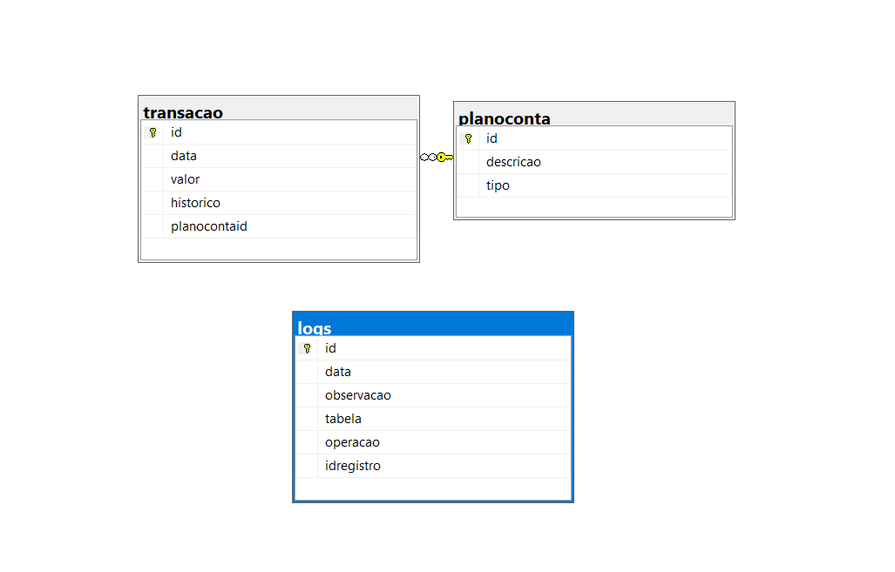
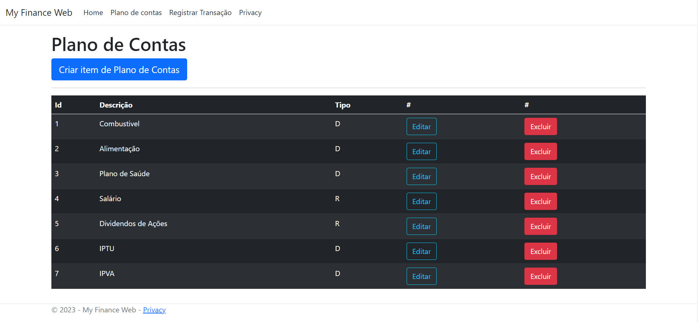
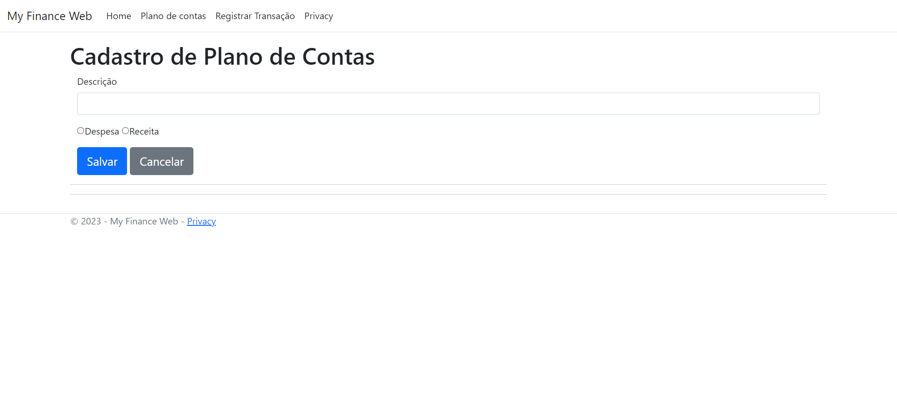
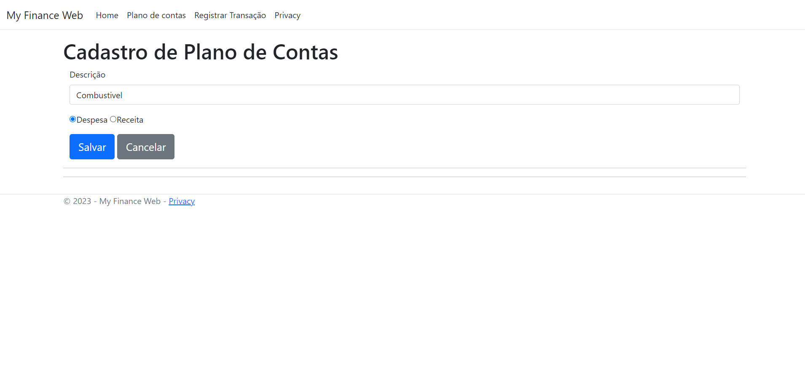
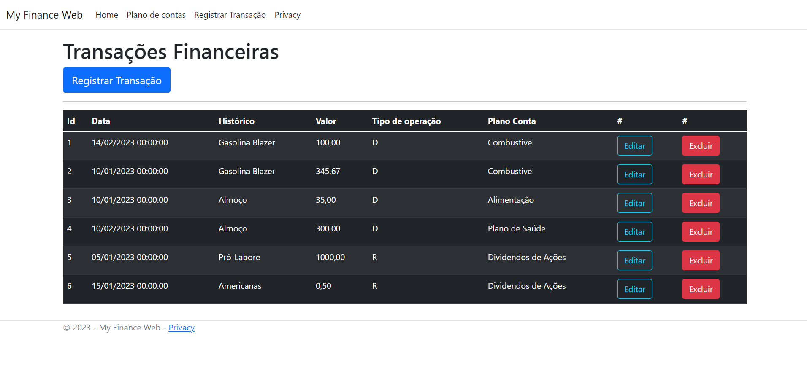
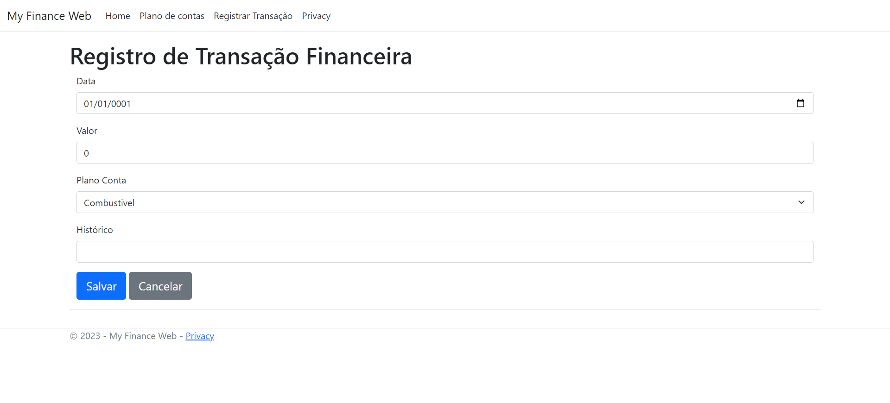
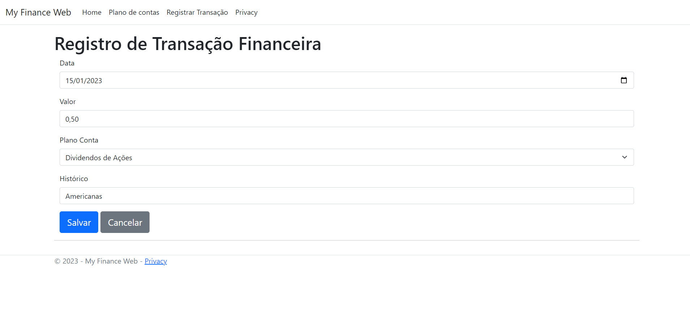
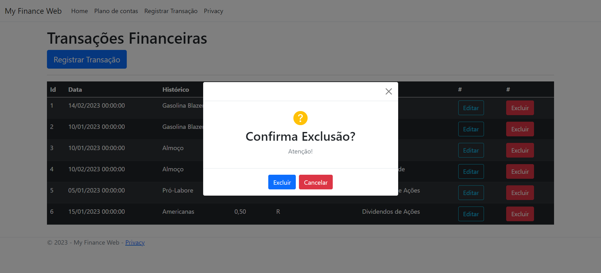
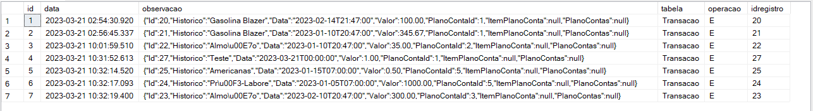

# MyFinance Web
MyFinance - Projeto do Curso de Pós-Graduação em Engenharia de Software da PUC-MG.

> Este projeto faz parte do Trabalho Final da Disciplina PRÁTICAS DE IMPLEMENTAÇÃO E EVOLUÇÃO DE SOFTWARE. Consiste de um sistema web para controle de finanças pessoais, com registros de transações, receitas e despesas.

## 💻 Requisitos
Antes da instalação do projeto é necessário ter uma IDE como o `Visual Studio` ou `Visual Studio Code` e a instalação do `ASP.NET`, `SQL Server` e `Git`. Ver seção [Tecnologias Utilizadas](#-tecnologias-utilizadas).

Após a instalação dessas ferramentas executar os scripts [myfinance_script](docs/myfinance_script.sql)  e [featureextra](docs/featureextra.sql).

## 💻 Tecnologias utilizadas
As principais tecnologias utilizadas foram:
- [ASP.NET Core MVC 6.0 ](https://dotnet.microsoft.com/pt-br/)
- [SQL Server](https://www.microsoft.com/pt-br/sql-server/sql-server-2022)
- [Razor](https://learn.microsoft.com/pt-br/aspnet/core/razor-pages/?view=aspnetcore-7.0&tabs=visual-studio)
- [Entity Framework](https://www.nuget.org/packages/Microsoft.EntityFrameworkCore.SqlServer/8.0.0-preview.2.23128.3)
- [Git](https://git-scm.com/download/win)

# Instalação
Para a instalação do projeto seguir os passos:

1. Clone o projeto
```bash
  git clone https://github.com/EmanuelleViana/myfinance-web-netcore
```
2. Acessar pasta do projeto
```bash
  cd .\myfinance-web-netcore\src\myfinance-web-netcore\ 
```

3. Executar 
```bash
  dotnet run 
```

ou, para refresh em tempo real 
```bash
  dotnet watch
```

4. Acessar pelo browser 
   https://localhost:7108


# DER - Diagrama de Entidades e Relacionamento
   

# Resultados e Funcionalidades

## Plano contas
   1. Listagem
   
        Nesta tela é possível ver todos os Planos cadastrados e ter acesso as ações para Editar, Excluir e Registrar um novo.
    

   2. Cadastro
   
       Contém um formulário que permite o cadastro de novo item de Plano.
      

   3. Edição
   
       É possível editar os dados de um item.
    
   4. Exclusão
    <p>A exclusão é feita através do botão de ação 'Excluir'</p>

## Transações
   1. Listagem
        <p>Nesta tela é possível ver todas as Transações cadastradas e ter acesso as ações para Editar, Excluir e Registrar uma nova.<p>
        
        

   2. Cadastro
      <p> Contém um formulário que permite o cadastro de novo item de Transação.</p>
      
      

   3. Edição
      <p>É possível editar os dados de um item.</p>
     
       
   4. Exclusão
       <p>A exclusão é feita através do botão 'Excluir' dentro do Modal.</p>


   5. **Modal de Confirmação - Feature Extra**
   <p>Popup que o pergunta sempre que se tentar realizar a exclusão de registros de transação. A exclusão desse     registro gera um log numa tabela do banco de dados modelado com as seguintes colunas: id, data, operação (I – Inclusão, A – Alteração ou E – Exclusão), observação, tabela, id_registro)</p>
  
  

*Exemplo de log:*




<hr> 

🍜 Práticas de Implementação e Evolução de Software - 2023 
